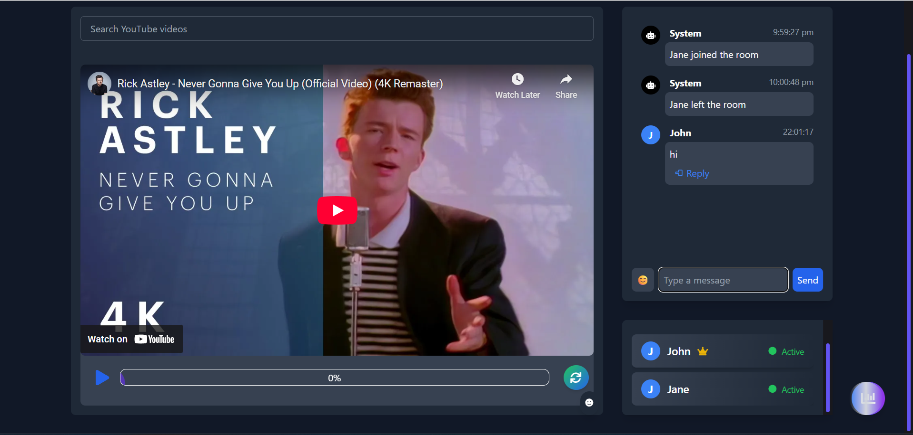
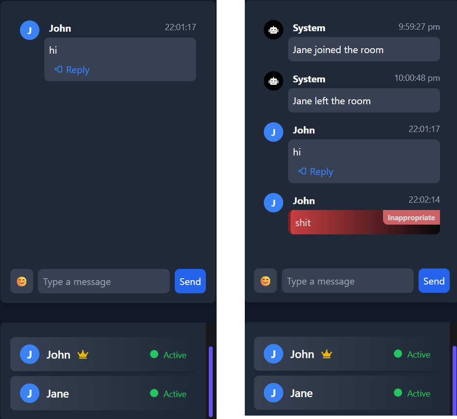

# Streame

Streame is a real-time collaborative chat and video sync platform built with a modern stack:

---

## About

**Streame** is a real-time collaborative platform for chat and video sync, designed for seamless group experiences. It features a Progressive Web App (PWA) for installable, offline-capable usage, and a robust leader-follower model for synchronized video playback.

# Streame

Streame is a real-time collaborative chat and video sync platform built with a modern stack:

- **Frontend:** React + Vite + Tailwind CSS
- **Backend:** Node.js (Express, Socket.io, MongoDB)
- **ML Toxicity Filter:** Python Flask API using Hugging Face Transformers

---

---

## Features

- **Progressive Web App (PWA):** Streame is installable on desktop and mobile, supports offline usage, and provides a native app-like experience. Add it to your home screen for quick access.

- **Leader-Follower Model:** Video synchronization is managed by a leader-follower architecture. The room leader controls playback (play, pause, seek), and all followers' players stay in sync. Leadership can be transferred if the leader leaves, ensuring continuous coordination.

- **Real-time Chat:** Join rooms and chat with others instantly.
- **Toxicity Detection:** Messages are checked for toxicity using a pre-trained ML model. Toxic messages are only shown to the sender with a warning and are not broadcast to others.
- **Video Sync:** Watch videos together in sync with room members.
- **User Presence:** See who is online, typing, and who is the room leader.
- **Emoji Reactions:** React to messages with emojis.
- **Message Reply:** Reply to specific messages in the chat.
- **Persistent Rooms & Messages:** All rooms, messages, and user events are stored in MongoDB.

---

## Screenshots

### Chat Room with Toxicity Detection



### Video Sync Feature


### Toxic Message Indication



---

## Getting Started

### 1. Clone the Repository

```sh
git clone https://github.com/yourusername/streame.git
cd streame
```

### 2. Install Dependencies

#### Frontend

```sh
cd frontend
npm install
```

#### Backend

```sh
cd ../Backend
npm install
```

#### ML Model API

```sh
cd ../ml-model
pip install -r requirements.txt
```

### 3. Start the Services

#### Start the ML Model API

```sh
cd ml-model
python app.py
```

#### Start the Backend Server

```sh
cd ../Backend
node server.js
```

#### Start the Frontend

```sh
cd ../frontend
npm run dev
```

---

## Configuration

- **MongoDB:** Make sure MongoDB is running and update the connection string in `Backend/config/db.js` if needed.
- **ML API:** The Flask app runs on port `5001` by default. The backend expects it at `http://localhost:5001/predict`.

---

## Project Structure

```
Streame/
│
├── frontend/         # React + Vite + Tailwind CSS
├── Backend/          # Express, Socket.io, MongoDB
├── ml-model/         # Flask API with Hugging Face Transformers
├── img/              # App screenshots for documentation
└── README.md
```

---

## Requirements

- Node.js
- Python 3.8+
- MongoDB
- See `ml-model/requirements.txt` for Python dependencies

---

## Credits

- Toxicity detection powered by [unitary/toxic-bert](https://huggingface.co/unitary/toxic-bert)
- Built with [React](https://react.dev/), [Vite](https://vitejs.dev/), [Tailwind CSS](https://tailwindcss.com/), [Express](https://expressjs.com/), [Socket.io](https://socket.io/), [Flask](https://flask.palletsprojects.com/), and [Transformers](https://huggingface.co/transformers/)

---

## License

MIT

---

